# Todo list :bulb:


Тестове завдання для відбору в IASA Student Council**

## Стек :computer: 
Java, Spring Boot, Spring Data JPA, PostgreSQL

## Вимоги:
1. Java - 17
2. Maven - 3.x.x
3. PostgreSQL - 15

## Інструкція встановлення:
1. Склонувати програму:
````
git clone 
````
2. * Налаштувати сервер PostgreSQL. 
   * Змінити налаштування application.properties (дефолтні username та password: postgres)


3. Створити та запустити програму за допомогою maven:
````
cd TodoList
mvn package
cd target
java -jar TodoList-0.0.1.jar
````

## Реалізований функціонал :bulb::

* Додавання таски
* Отримання таски
* Редагування таски
* Отримання тасок (від нових до старих, від старих до нових)
  * всіх
  * виконаних
  * невиконаних
* Видалення таски 
* Видалення всіх тасок

## Перевірка :straight_ruler:
Тестування проводилось через Postman

### Додавання таски 

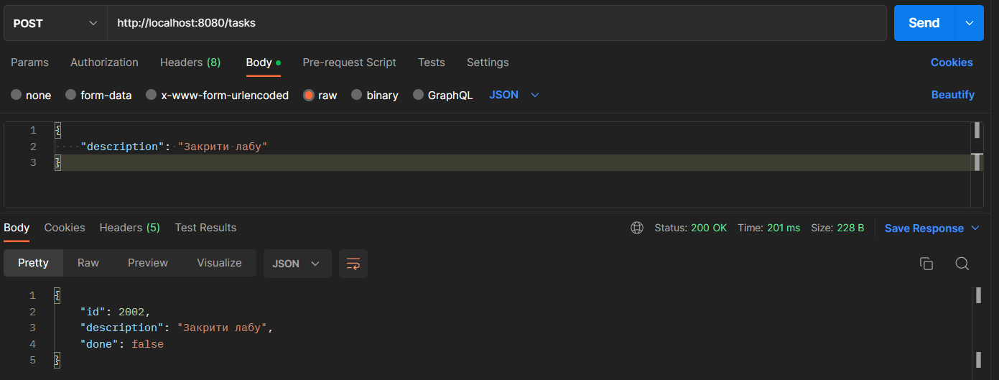

### Отримання таски

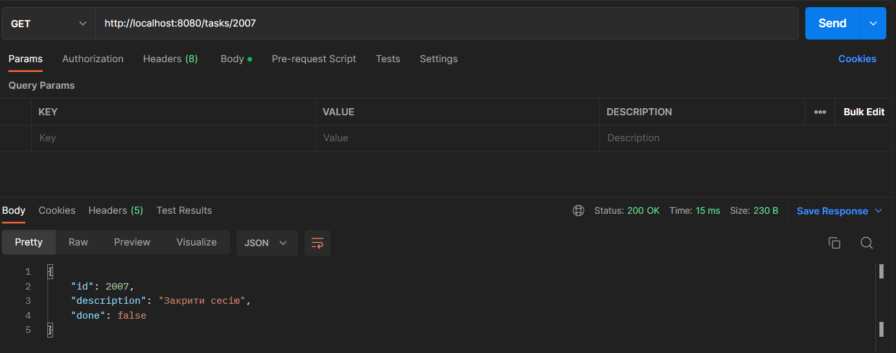

### Редагування таски

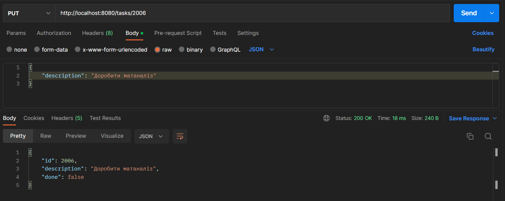

### Отримання тасок (за замовчуванням від нових до старих)

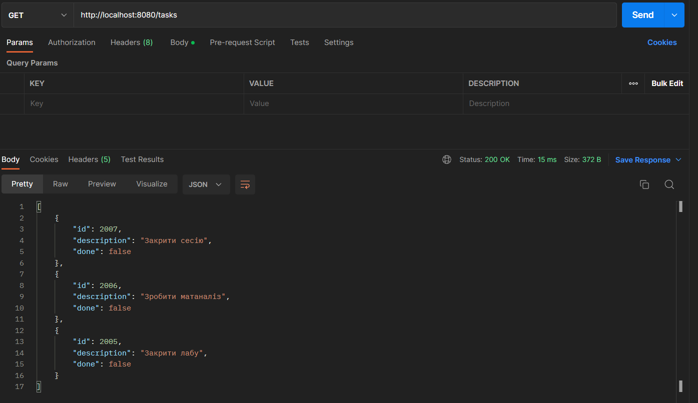

### Отримання тасок (від старих до нових) 


### Отримання виконаних тасок (за замовчуванням від нових до старих)

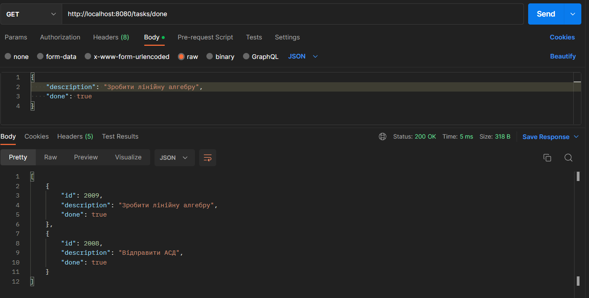

### Отримання виконаних тасок (від старих до нових)

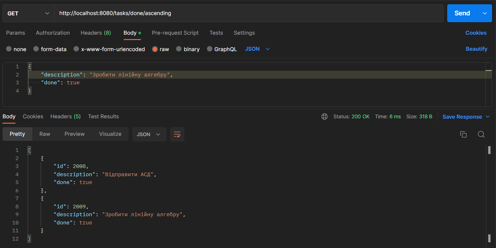

### Отримання невиконаних тасок (за замовчуванням від нових до старих)

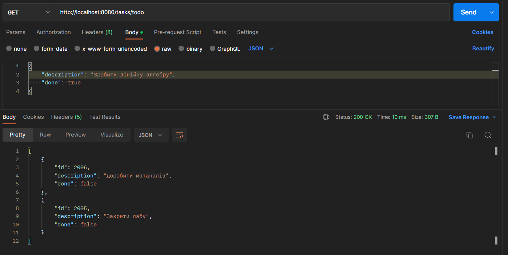

### Отримання невиконаних тасок (від старих до нових)

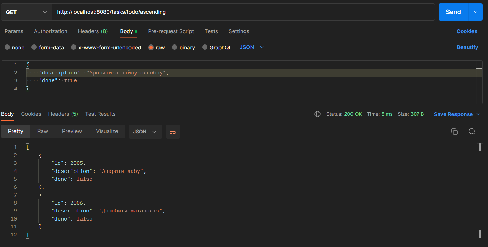

### Видалення таски

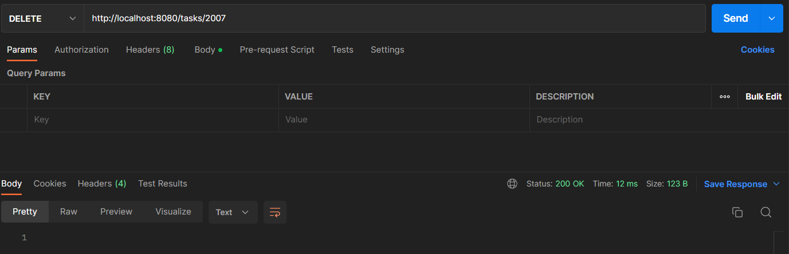

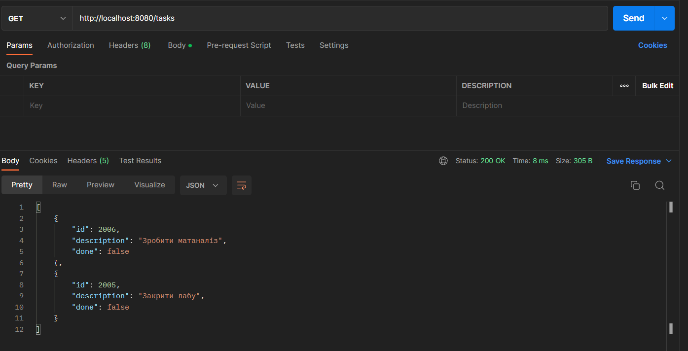

### Видалення всіх тасок

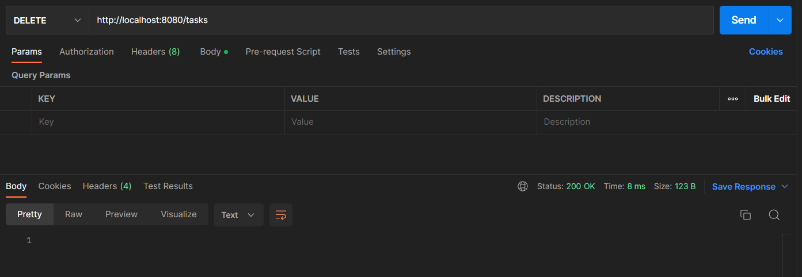

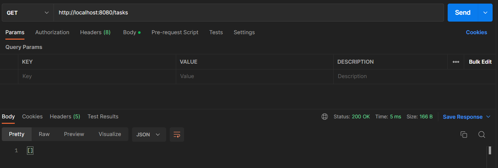
